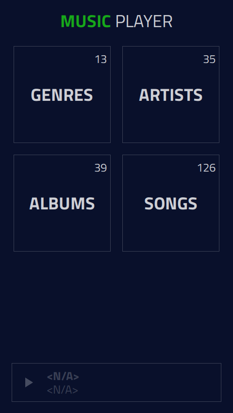

# Qt And Android: Music Player

Let’s compare by building an embedded system with a music player app on an NXP iMX.8 Quad board.

## Table of Contents

1. Context
1. White paper
1. Features
1. Qt
    1. Project structure
    1. Screenshots
    1. Requirements
    1. Getting Started With Development
    1. Testing on a device
    1. 3rd party libraries
1. Android
    1. Project structure
    1. Screenshots
    1. Requirements
    1. Getting Started With Development
    1. Testing on a device
    1. Testing on emulator
    1. 3rd party libraries
1. Contribution
1. Contact
1. Credits
1. License

## Context

Why choose Linux and Qt rather than Android for embedded devices? Qt and Android are often complementary (automotive, smartphone) and Witekio teams complete an equivalent number of Android and Linux/Qt projects. Everyone has their favorite, but no one had ever achieved an exhaustive and unbiased comparison. 

It was all about comparing Android and Qt, evaluating each solution’s advantages and drawbacks for embedded software developers. 
 
To achieve this, the Witekio developers team decided to build on a real-life example: develop a Music player app on an NXP i.MX 8 Quad board. 

## White paper

These two demo applications were created for our Qt And Android whitepaper. When the whitepaper is available, this README will be updated with a link to download it.

## Features

Whether it's the Qt project or the Android project, our Music Player contains the same features:

* [x]  Browser device filesystem
* [x]  List all music available in a selected folder
* [x]  Retrieve music information (genre, artist, album, ...)
* [x]  Playing music in the foreground and background

## Qt

### Project structure


The MusicPlayer project is composed of two separate projects: *MusicPlayerUI* and *MusicPlayerBackend*.

The first one contains all the graphic elements necessary to display the application. While the second contains all the non-graphical elements allowing to play the music in the background without interruption.

All classes are written in **C++** and **QML**.

### Screenshots

Home page | All songs page | Playing song page
------------ | ------------ | ------------
||

### Requirements

* Qt 5.13
* Qt Creator
* NXP i.MX 8 Quad board with a Linux BSP which contains :
    * Yocto
    * Qt
    * Wayland
    * Eglfs
* You can also run the Music Player locally

### Getting Started With Development

> **INFORMATION** Before start, please check the requirements section.

1. Fork "Qt And Android" by clicking on Github's Fork button above (you may have to log in first).
2. Install the following:
    * git
    * [Qt Creator](https://www.qt.io/download) 5.13. The open-source (community) version is enough. (You will need a Qt account).
    * If you are under Windows, also install MinGW for your system architecture (x86 or x64).
3. Use git to clone your forked repositories
    * `git clone git@github.com:yourgithubid/qt-vs-android.git`. Here this is the SSH version, if you don't have an SSH key, you can also use the HTTPS version (see Github's [instructions](https://help.github.com/en/github/creating-cloning-and-archiving-repositories/cloning-a-repository) if you need help).

### Testing on a device

1. Open Qt Creator and select the file "MusicPlayerApp.pro". By default Qt Creator will have designed all the Kits available on your machine. Select the most adequate one for your target. For example, in the case of a Windows deployment with MinGW for a 64-bit architecture, here are the parameters. 


If the icon on the left is an exclamation mark or a warning, your confirmation is not correct. 

2. In the "Projects" menu and the "Run" tab of your active Kits, you will need to add a new step. Add a "Custom Process Step" with the following values :
    * **Command:** make
    * **Arguments:** install
    * **Working directory :** %{buildDir}

The goal here is to design a complete application, combining *MusicPlayerUI* and *MusicPlayerBackend*.


> **WARNING**! This last argument may change if you have modified the compilation path or added other steps that modify the folder tree.

In case you are on Windows, it is sometimes necessary to directly specify the entire execution path of the "make" program. In my case : `C:\Qt\Tools\mingw730_64\bin\mingw32-make.exe`

3. If you want to deploy the application directly on an NXP i.MX 8 board, it will be necessary to add the target device information.

4. Launch a compilation. If it is successful you can use the application. Otherwise check the parameters.

### 3rd party libraries

This project is using no other external dependencies, and rely exclusively on Qt components and classes.

## Android

### Project structure


The MusicPlayer project is composed of two separate projects: *MusicPlayer* and *MusicPlayerBackend*.

The first one contains all the graphic elements necessary to display the application. While the second contains all the non-graphical elements allowing to play the music in the background without interruption.

All classes are written in **Java**.

### Screenshots

Home page | All songs page | Playing song page
------------ | ------------ | ------------
||

### Requirements

* Android Studio
* Android SDK Q (10.0)
* Build Tools Version 29.0.2
* Gradle 3.5.3
* An Android (developer) phone or emulator with version 9.0 or higher
* NXP i.MX 8 Quad board with Android BSP. You can download it here: https://www.nxp.com/webapp/Download?colCode=P9.0.0_2.0.0_GA_DEMO_8MQ&appType=license (**you need an NXP account**)

### Getting Started With Development

> **INFORMATION** Before start, please check the requirements section.

1. Create your own fork of "Qt And Android" by clicking on Github's Fork button above (you may have to log in first).
1. Install the following:
    * git
    * [Android Studio](https://developer.android.com/studio) 3 or later
    * Android SDK Q (10.0)
1. Use git to clone your forked repositories
    * `git clone git@github.com:yourgithubid/qt-vs-android.git`. Here this is the SSH version, if you don't have an SSH key, you can also use the HTTPS version (see Github's [instructions](https://help.github.com/en/github/creating-cloning-and-archiving-repositories/cloning-a-repository) if you need help).

### Testing on a device

How to debug/test on a USB device:

1. Plug your device and make sure you can see it by running `adb devices` or via the Android Studio interface
2. Press the "play" button to launch the application without debugger (breakpoints won't work) or the cockroach to launch the application with the debugger.

3. If you do not see your phone in the list of available devices, check the following information:
    * OS version: Android 9.0 or later
    * On some devices, having several users, it is sometimes necessary to uninstall the application for all of them before deploying it again (see below).
    * Put your device in file transfer mode: (see below)
    * Your phone is not configured for development. If this is the case, please follow the instructions below: https://developer.android.com/studio/debug/dev-options
    * Put your device on debug mode : (see below)

Device file transfer mode | Device debug mode | Uninstall for all users
------------ | ------------ | ------------
||


4. As a last resort, go directly to the command line:
    * `adb kill-server`
    * `adb usb`
    * `adb devices` (make sure your device is listed)
    * `adb uninstall com.witekio.whitepaper.musicplayer` (you should see "Failure" if this was uninstalled already)
    * And now relaunch the application (in debug mode or not) from Android Studio.

> **WARNING** Platform tools must have been added to your Path for the `adb` command to be recognized.

### Testing on emulator

If you don't have a physical phone, Android Studio will allow you to create emulators to test and debug the application directly on your computer.

To do this, create a new emulator via the AVD Manager (or Android Virtual Device Manager) via this icon:


Just like a physical device, your emulator must have at least Android version 9.0 (API 28) for the application to work. All the other parameters can be set at will. 


Then launch the application as for a classic device.

### 3rd party libraries

No external dependencies, the application was entirely made using Android native components.

## Contributions

If you encounter a problem, please feel free to file an issue.

Patches are encouraged and may be submitted by forking this project and submitting a pull request. Since this project is still in its very early stages, if your change is substantial, please raise an issue first to discuss it.

## Contact
###


You can contact us on our website: https://www.witekio.com/contact/

## Credits

Thanks to Julien Hecht, Erwan Sepulcre, Stephen Faure, everyone who helped at Witekio, and to The Qt Company!

## License

```
Copyright (C) 2020 Witekio.
Contact: http://www.witek.io/

You may use this file under the terms of the BSD license as follows:

"Redistribution and use in source and binary forms, with or without
 modification, are permitted provided that the following conditions are
 met:
   * Redistributions of source code must retain the above copyright
     notice, this list of conditions and the following disclaimer.
   * Redistributions in binary form must reproduce the above copyright
     notice, this list of conditions and the following disclaimer in
     the documentation and/or other materials provided with the
     distribution.
   * Neither the name of Witekio nor the names of its
     contributors may be used to endorse or promote products derived
     from this software without specific prior written permission.

THIS SOFTWARE IS PROVIDED BY THE COPYRIGHT HOLDERS AND CONTRIBUTORS
"AS IS" AND ANY EXPRESS OR IMPLIED WARRANTIES, INCLUDING, BUT NOT
LIMITED TO, THE IMPLIED WARRANTIES OF MERCHANTABILITY AND FITNESS FOR
A PARTICULAR PURPOSE ARE DISCLAIMED. IN NO EVENT SHALL THE COPYRIGHT
OWNER OR CONTRIBUTORS BE LIABLE FOR ANY DIRECT, INDIRECT, INCIDENTAL,
SPECIAL, EXEMPLARY, OR CONSEQUENTIAL DAMAGES (INCLUDING, BUT NOT
LIMITED TO, PROCUREMENT OF SUBSTITUTE GOODS OR SERVICES; LOSS OF USE,
DATA, OR PROFITS; OR BUSINESS INTERRUPTION) HOWEVER CAUSED AND ON ANY
THEORY OF LIABILITY, WHETHER IN CONTRACT, STRICT LIABILITY, OR TORT
(INCLUDING NEGLIGENCE OR OTHERWISE) ARISING IN ANY WAY OUT OF THE USE
OF THIS SOFTWARE, EVEN IF ADVISED OF THE POSSIBILITY OF SUCH DAMAGE."
```
